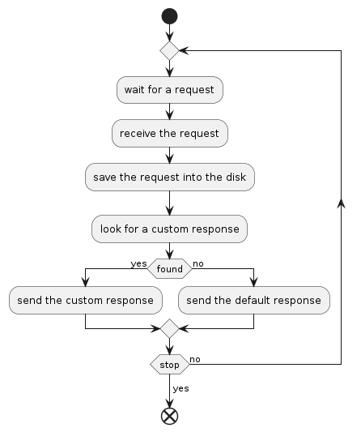

# dummy-http-server

## Description

**dummy-http-server** is a lightweight HTTP server designed to capture all 
requests received by it. Its main purpose is to be used as a placeholder for REST
services during its development and debugging.

As a development/testing tool, this program is not designed deal with large
volume of requests. In fact, the whole idea is to be as small, simple and 
lightweight as possible.

This version is based on one of the internal testing tools created by **OpenCS**
to help the develpment and evaluation of HTTP based APIs and applications. It was
originally written in **Java EE 5** and has been ported to **Go** as a way to be
as small and portable as possible.

## Use cases

- Fast HTTP listener (non interactive);
- Inspect requests and debug it;
- Placeholder for unfinished API servers;

## Supported platforms

**dummy-http-server** is a small Go program that can be executed on the following
platforms:

- Windows x64;
- Linux x64;
- Linux AA64;

## How it works

This program starts a simple HTTP server and perform the following procedure for
each request:



It stops the server by receiving a `SIGINT`.

## Running the program

To run this program, create a configuration file with the desired parameters and
run:

```
dummy-http-server -c <path to the configuration file>
```

If the configuration file is not provided, it will try to load the file
`config.yaml` in current directory.

To get more information about the commands, use:

```
dummy-http-server --help
```

## Configuration file

This programs requires a configuration file in order to work. It defines the 
basic properties of the service and also custom responses that may be returned
according to the path and method of the request.

This is an example of a configuration file:


```yaml
address: "localhost:8080"
captureDir: "var"
readTimeout: 15
writeTimeout: 15
maxRequestSize: 1024
responses:
  - pathPattern: ^\/b.*
    methods:
      - GET
      - POST
    contentType: text/plain
    body: AAAA
    returnCode: 201
  - pathPattern: "\\/a.*"
    contentType: "text/html"
    body: BBBB
```

### Server properties

#### address

The binding address. Defaults to `:8080` which binds to all adapters on port 8080.

#### captureDir

Path to the directory that will hold the captured requests and the log file. 
Defaults to `var`.

#### readTimeout

Read timeout in seconds. Defaults to 15s.

#### writeTimeout

Write timeout in seconds. Defaults to 15s.

#### maxRequestSize

Maximum size of the request in bytes. If the given request is larger than this
value, the remaining of the request will be ignored. It defaults to 1MB.

### Requests

A definition of specially crafted responses that are selected based on the methods
and paths. They are selected using the first match priority thus the order of the
responses will affect the matching results.

If this list is empty or no response matches the request, it will always fallback
to the default response that returns the status code 200 and an empty JSON object.

#### pathPattern

The pattern that will define if the path will match with this request. If not set
this request will match with all paths.

The pattern will be tested as is against the full request path. If it matches, the
request will be accepted by this response. Given that, do not forget to consider
the start and end of a pattern (with '^' and '$') and the fact that the path will
contain the query parameters when available.

It is also possible to test the regular expressions and matches by using the CLI
command `test_pattern`.

The regular expression syntax used by this program follows the RE2 syntax defined
by **Go**. See [regexp/syntax](https://github.com/google/re2/wiki/Syntax) for 
further details.

#### methods

List of methods that this response will match. If not set, all methods will match
this request.

#### contentType

The content type of the response. If not set, It will have no content type.

#### body

The body or the response in bytes encoded in Base64. If not set, the response will
have no body at all.

#### skipCapture

If true, this flag will prevent the capture of the request.

## Deployment

### Test

For development and test, **dummy-http-server** can be executed directly out of
the box unless HTTPS is required.

### Production

For production, it is better to run **dummy-http-server** behind a reverse proxy
under a non root user. This is specially true if HTTPS is required.

> When running in production, set all paths in the configuration to absolute
> paths.

#### Systemd

If you need to automatically start  **dummy-http-server** on system startup, the
following systemd service template can be used:

```ini
[Unit]
Description=dummy-http-server
After=network.target

[Service]
Type=exec
ExecStart=/path/to/dummy-http-server -c /path/to/config.yaml
Restart=always
User=<user that will run dummy-http-server>

[Install]
WantedBy=multi-user.target
```

## License

This software is licensed under the terms of BSD 3-Clause License.

## Contributions

We are not actively accepting contributions to this program right now. It has
been released mainly to be used as a tool by our customers and partners.
